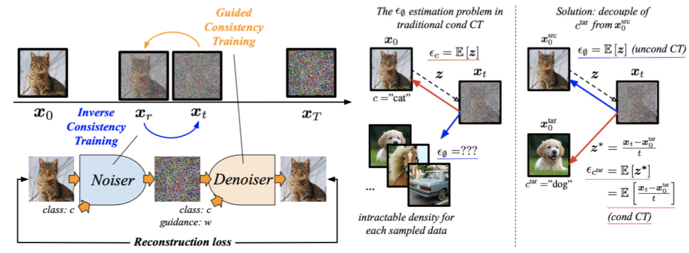

# Beyond and Free from Diffusion: Invertible Guided Consistency Training

**Pytorch implementation for Invertible Guided Consistency Training (iGCT)** (arXiv coming soon).

We propose invertible Guided Consistency Training (iGCT), a diffusion independent approach that integrates guidance and inversion into Consistency Models. iGCT is a fully data-driven algorithm that enables fast guidance generation, fast inversion, and fast editing. 



## Environment Setup

To set up the environment, follow these steps:

### Using Python Virtual Environment
```bash
python -m venv igct
source igct/bin/activate
```

### Using Conda
```bash
conda create -n igct python=3.9 -y
conda activate igct
```

### Install Dependencies
```bash
pip install click requests pillow numpy scipy psutil tqdm imageio scikit-image imageio-ffmpeg pyspng
pip install torch==2.3.0+cu121 -f https://download.pytorch.org/whl/torch_stable.html
pip install lpips transformers
```

## Datasets

Ensure a GPU is available for dataset preparation. Follow the instructions below to download and prepare the datasets.

### CIFAR-10
1. Download the [CIFAR-10 python version](https://www.cs.toronto.edu/~kriz/cifar.html).
2. Convert the dataset to a ZIP archive:
   ```bash
   mkdir downloads && cd downloads
   mkdir cifar10 && cd cifar10
   curl -O https://www.cs.toronto.edu/~kriz/cifar-10-python.tar.gz 
   cd ../..
   python dataset_tool.py --source=downloads/cifar10/cifar-10-python.tar.gz --dest=datasets/cifar10-32x32.zip
   python dataset_tool.py --source=downloads/cifar10/cifar-10-python.tar.gz --dest=datasets/cifar10-32x32-test.zip --testset=true
   ```
3. Compute FID statistics:
   ```bash
   python fid.py ref --data=datasets/cifar10-32x32.zip --dest=fid-refs/cifar10-32x32.npz
   ```

### ImageNet
1. Download the [ImageNet Object Localization Challenge](https://www.kaggle.com/competitions/imagenet-object-localization-challenge/data).
2. Convert the dataset to a ZIP archive at 64x64 resolution:
   ```bash
   python dataset_tool.py --source=downloads/imagenet/ILSVRC/Data/CLS-LOC/train \
       --dest=datasets/imagenet-64x64.zip --resolution=64x64 --transform=center-crop
   ```
3. Organize the ImageNet validation set directory:
   ```bash
   python organize_imagenet_dataset.py --annote_dir downloads/imagenet/ILSVRC/Annotations/CLS-LOC/val --images_dir downloads/imagenet/ILSVRC/Data/CLS-LOC/val
   ```
4. Convert the validation set to a ZIP archive:
   ```bash
   python dataset_tool.py --source=downloads/imagenet/ILSVRC/Data/CLS-LOC/val --dest=datasets/imagenet-64x64-val.zip --resolution=64x64 --transform=center-crop
   ```
5. Compute FID statistics:
   ```bash
   python fid.py ref --data=datasets/imagenet-64x64.zip --dest=fid-refs/imagenet-64x64.npz
   ```
6. Create ImageNet subgroups for image editing:
   ```bash
   python create_imagenet_editing_subgroups.py --dataset_path datasets/imagenet-64x64-val.zip --save_dir datasets/imagenet-64x64-editing-subgroups
   ```

## Training and Evaluation Scripts

Example scripts for training and evaluation can be found in the `./scripts` directory.

## Checkpoints

Pre-trained model checkpoints are available for download. The checkpoints are organized as follows:

```
model_weights/
├── cifar10/
│   ├── baselines/
│   │   ├── cfg-edm/                # Checkpoints for CFG-EDM baseline on CIFAR-10
│   │   └── guided-cd/              # Checkpoints for Guided-CD baseline on CIFAR-10
│   └── igct/
│       └── igct/                   # Checkpoints for iGCT on CIFAR-10
│
└── imagenet/
    ├── baselines/
    │   └── cfg-edm/                # Checkpoints for CFG-EDM baseline on ImageNet
    └── igct/
        └── igct/                   # Checkpoints for iGCT on ImageNet
```

Download the checkpoints from the [model_weights](https://drive.google.com/drive/folders/11K5qHwl4I45vNOvN_nG3FfTjbjLnkmTW?usp=sharing) Google Drive link.

## Contact

For questions, feedback, or collaboration opportunities, feel free to reach out via email at [charleston87654321@gmail.com](mailto:charleston87654321@gmail.com) or [chia_hong_hsu@brown.edu](mailto:chia_hong_hsu@brown.edu)

## Citation

If you find this work useful, please consider citing our paper (arXiv link coming soon):

```bibtex
```

---
